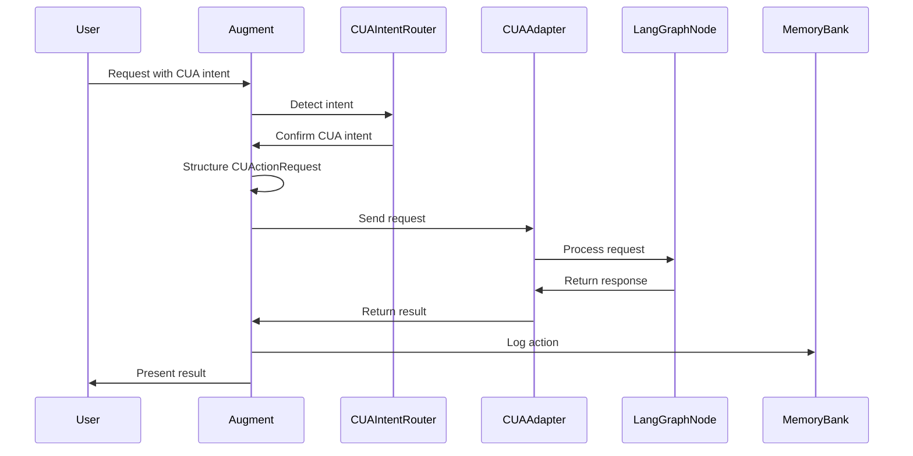

# Augment CUA Routing

## Overview

This document describes how Augment should handle Computer Use Agent (CUA) intents and delegate them to the appropriate LangGraph node. It outlines the detection, validation, and routing process for CUA actions.

## Augment's Role in CUA Delegation

Augment serves as a primary entry point for many user requests that may involve computer use actions. When Augment detects a CUA-compatible intent, it should:

1. Validate the intent against security policies
2. Structure the request according to the CUAction schema
3. Delegate to the LangGraph CUA node
4. Process and integrate the results

## Intent Detection

Augment should detect the following types of CUA intents:

### File Operations

- Reading files
- Writing files
- Creating files
- Editing files
- Deleting files

### Command Execution

- Running shell commands
- Executing scripts
- Installing packages
- Building projects
- Running tests

### Web Browsing

- Opening URLs
- Fetching web content
- Navigating to documentation

## Routing Process

When Augment detects a CUA intent, it should follow this process:



## Security Considerations

Augment should apply the following security checks before routing CUA intents:

1. **Path Validation**: Ensure file paths are within allowed directories
2. **Command Validation**: Verify commands against an allowlist
3. **URL Validation**: Check URLs against allowed domains
4. **Dry Run Option**: Consider using dry run mode for potentially destructive actions

## Example Routing Logic

```typescript
// Example of Augment's CUA routing logic
function handlePotentialCUAIntent(prompt: string, agentId: string): boolean {
  // Check if the prompt contains a CUA intent
  const cuaIntentRouter = new DefaultCUAIntentRouter();
  
  if (cuaIntentRouter.detectCUAIntent(prompt)) {
    // Extract the CUA request
    const cuaRequest = cuaIntentRouter.extractCUARequest(prompt, agentId);
    
    if (cuaRequest) {
      // Apply security checks
      if (!isSecureRequest(cuaRequest)) {
        return false;
      }
      
      // Route to CUA adapter
      const cuaAdapter = new CUAAdapter({
        type: AgentType.augment,
        dryRunDefault: false
      });
      
      // Process the request
      cuaAdapter.send({
        prompt: JSON.stringify(cuaRequest),
        context: { cuaRequest }
      }).then(response => {
        // Log the action
        const memoryManager = new DefaultCUAMemoryManager();
        memoryManager.recordAction(cuaRequest, JSON.parse(response.content));
        
        // Present the result to the user
        console.log(response.content);
      });
      
      return true;
    }
  }
  
  return false;
}
```

## Integration with .cursorrules

Augment's .cursorrules should be updated to include the CUA_AGENT_ROLE:

```yaml
# .cursorrules extension for CUA
assistants:
  augment:
    roles:
      - SCAFFOLD_AGENT_ROLE
      - OPTIMIZE_AGENT_ROLE
      - CUA_AGENT_ROLE
    permissions:
      - file_read
      - file_write
      - command_execution
      - web_access
```

## Memory Integration

Augment should tag CUA actions in the memory bank for traceability:

```typescript
// Example of memory tagging for CUA actions
function tagCUAAction(request: CUActionRequest, response: CUActionResponse): string[] {
  const tags = [
    `cu-action-${request.action_type}`,
    `status-${response.status.toLowerCase()}`,
    `agent-augment`
  ];
  
  if (request.dry_run) {
    tags.push('dry-run');
  }
  
  return tags;
}
```

## User Interaction

Augment should provide clear feedback to users about CUA actions:

1. **Before Action**: Confirm potentially destructive actions
2. **During Action**: Provide progress updates for long-running actions
3. **After Action**: Summarize the results and any side effects

## Error Handling

Augment should handle CUA errors gracefully:

1. **Validation Errors**: Explain what's wrong with the request
2. **Execution Errors**: Provide context and suggest fixes
3. **Permission Errors**: Explain security constraints
4. **Timeout Errors**: Suggest breaking into smaller steps

## References

- [CUAction Schema](../schemas/cuaction.schema.md)
- [LangGraph CUA-PY Integration](../tools/langgraph-cua-py-integration.md)
