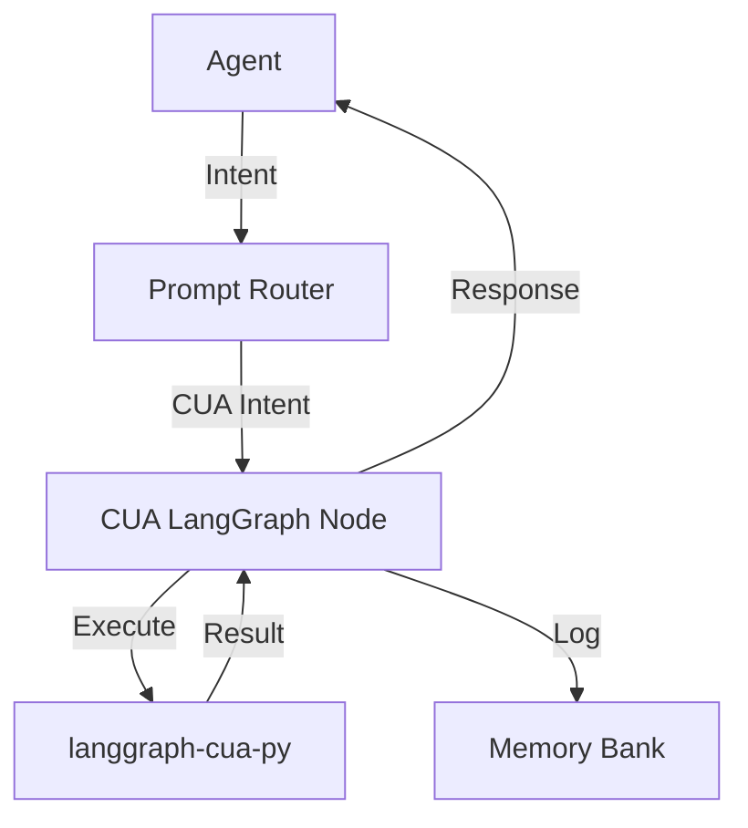

# LangGraph CUA-PY Integration

## Overview

This document describes the integration of `langgraph-cua-py` into the Mirrorwright Orchestrator system. The integration enables Computer Use Agent (CUA) capabilities, allowing agents to perform file system operations, run commands, and browse the web in a controlled, sandboxed environment.

## Architecture

The integration follows a node-based architecture using LangGraph:



### Components

1. **CUA LangGraph Node**: A wrapper around `langgraph-cua-py` that handles CUA actions.
2. **CUA Intent Router**: Detects CUA intents in prompts and routes them to the CUA node.
3. **CUA Memory Manager**: Records CUA actions and their results for traceability.
4. **CUA Agent Adapter**: Integrates with the existing agent system.

## Schema

The CUA integration uses two main schemas:

1. **CUActionRequest**: Defines the structure of CUA action requests.
2. **CUActionResponse**: Defines the structure of CUA action responses.

### CUActionRequest

```yaml
action_type: open_file | write_file | run_command | browse_web
payload: structured (path, content, command, etc.)
context: mode, agent_id, timestamp
dry_run: boolean (optional)
```

### CUActionResponse

```yaml
result: stdout | success | error
status: success | error
metadata: duration, retries, environment
```

## Usage

### Agent Integration

Agents can use the CUA capabilities by:

1. Detecting CUA intents in user prompts
2. Routing the intent to the CUA node
3. Processing the response and updating memory

### Example: File Operation

```typescript
// Example of a CUA action request for file operation
const request: CUActionRequest = {
  action_type: CUActionType.WRITE_FILE,
  payload: {
    path: 'example.txt',
    content: 'Hello, world!'
  },
  context: {
    agent_id: 'agent-123',
    timestamp: new Date().toISOString()
  }
};

// Send the request to the CUA adapter
const response = await cuaAdapter.send({
  prompt: JSON.stringify(request),
  context: { cuaRequest: request }
});

// Process the response
console.log(response.content);
```

### Example: Command Execution

```typescript
// Example of a CUA action request for command execution
const request: CUActionRequest = {
  action_type: CUActionType.RUN_COMMAND,
  payload: {
    command: 'echo',
    args: ['Hello, world!']
  },
  context: {
    agent_id: 'agent-123',
    timestamp: new Date().toISOString()
  }
};

// Send the request to the CUA adapter
const response = await cuaAdapter.send({
  prompt: JSON.stringify(request),
  context: { cuaRequest: request }
});

// Process the response
console.log(response.content);
```

## Security Considerations

The CUA integration includes several security features:

1. **Dry Run Mode**: Validate but don't execute actions.
2. **Path Restrictions**: Limit file operations to allowed paths.
3. **Command Allowlist**: Restrict command execution to allowed commands.
4. **Timeouts**: Prevent runaway processes.
5. **Sandboxing**: Execute commands in a controlled environment.

## Memory Integration

CUA actions are logged in the memory bank with the following tags:

- `cu-action-{action_type}`: Type of action
- `status-{success|error}`: Status of the action
- `agent-{agent_id}`: Agent that performed the action
- `dry-run`: If the action was a dry run

## Future Enhancements

1. **Natural Language Parsing**: Improve extraction of CUA actions from natural language.
2. **Multi-Step Workflows**: Support sequences of CUA actions.
3. **Permission System**: Fine-grained control over allowed actions.
4. **UI Integration**: Visual feedback for CUA actions.
5. **Audit Trail**: Comprehensive logging of all CUA actions.

## References

- [LangGraph Documentation](https://python.langchain.com/docs/langchain_graph)
- [langgraph-cua-py Repository](https://github.com/example/langgraph-cua-py)
