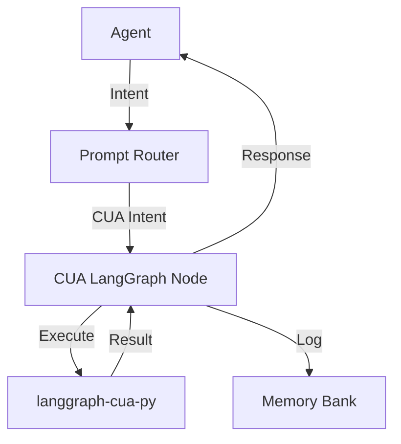

# Memory Entry: CUA Integration Plan

## Title

Computer Use Agent (CUA) Integration with LangGraph

## Tags

cua,integration,langgraph,mirrorwright,schema,agent,memory

## Notes

Implemented a comprehensive integration of `langgraph-cua-py` into the Mirrorwright Orchestrator system, enabling Computer Use Agent (CUA) capabilities for file operations, command execution, and web browsing:

1. **Schema and Interface Development**:
   - Created `cuaction.schema.json` for validating CUA requests and responses
   - Developed TypeScript interfaces in `cuaction.ts` for type safety
   - Defined LangGraph node interface for consistent node implementation

2. **Core Components**:
   - Implemented `CUAAdapter` as an AgentAdapter for the agent system
   - Created `CUALangGraphNode` to wrap langgraph-cua-py functionality
   - Developed `CUAIntentRouter` for detecting and routing CUA intents
   - Built `CUAMemoryManager` for tracking and retrieving CUA actions

3. **Security Features**:
   - Added dry-run mode for testing without execution
   - Implemented path validation for file operations
   - Created command allowlist for command execution
   - Added timeout support for long-running operations

4. **Documentation**:
   - Created integration documentation in `docs/strategic-ai-reference/tools/langgraph-cua-py-integration.md`
   - Added schema documentation in `docs/strategic-ai-reference/schemas/cuaction.schema.md`
   - Documented Augment's CUA routing in `docs/strategic-ai-reference/assistants/augment-cua-routing.md`
   - Updated memory bank configuration to include CUA action tags

5. **Testing**:
   - Created tests for the CUA adapter, intent router, and memory manager
   - Implemented example usage in `src/examples/cuaExample.ts`
   - Added prompt templates for Augment and Cline

6. **Integration with Existing Systems**:
   - Updated `.cursorrules` to include the `CUA_AGENT_ROLE`
   - Extended prompt frontmatter standard to include CUA intent
   - Added memory bank tags for CUA actions

7. **Next Steps**:
   - Implement actual langgraph-cua-py integration (currently placeholder)
   - Add natural language parsing for CUA intents
   - Create more comprehensive test suite
   - Develop UI for CUA action feedback

## Implementation Notes

The CUA integration follows a node-based architecture using LangGraph:

The integration is designed to be:
- **Secure**: With dry-run mode, path validation, and command allowlist
- **Traceable**: With memory integration for action logging
- **Extensible**: With a modular architecture for adding new action types
- **User-friendly**: With natural language intent detection

## Related Files

- `src/schemas/cuaction.schema.json`
- `src/types/cuaction.ts`
- `src/types/langgraph.ts`
- `src/agents/CUAAdapter.ts`
- `src/router/CUAIntentRouter.ts`
- `src/memory/CUAMemoryManager.ts`
- `docs/strategic-ai-reference/tools/langgraph-cua-py-integration.md`
- `docs/strategic-ai-reference/schemas/cuaction.schema.md`
- `docs/strategic-ai-reference/assistants/augment-cua-routing.md`
- `docs/strategic-ai-reference/memory/memory-bank-cua-tags.md`
- `docs/strategic-ai-reference/templates/prompt-frontmatter-cua-extension.md`
- `tests/cua/cuaAdapter.test.ts`
- `tests/cua/cuaIntentRouter.test.ts`
- `tests/cua/cuaMemoryManager.test.ts`
- `src/examples/cuaExample.ts`
- `prompt_templates/augment-cua-integration.md`
- `prompt_templates/cline-cua-scenarios.md`
- `.cursorrules`
